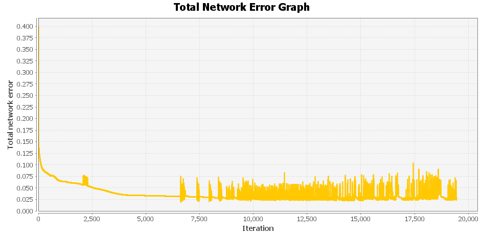

# MLP_based_music_genre_classification

## Attribute Information

* Duration :- Song's duration in seconds
* Tempo :- in beats per minute (BPM)
* Root mean square (RMS) :- amplitude in dB. The RMS (Root-Mean-Square) value is the effective value of the total waveform. In audio it is the continuous or music power that the amplifier can deliver.
* Sampling frequency in kHz
* Sampling rate :- also in kHz. There are two major common sample rate bases 44.1 kHz and 48 kHz. 
* Dynamic range(dr) :- in dB. Dynamic range, abbreviated DR or DNR, is the ratio between the largest and smallest possible values of a changeable quantity, such as in signals like sound and light. 
* Tonality :- can be C, C#, D, D#, E, F, F#, G, G#, A, Bb and B, with associated values from 0 to 11 respectively.
* Number of digital errors(nde) :- There are two types of digital errors, glitches and clipping, but our number is sum of both . 
* Genre name :- classic, rock, jazz and folk

## Results and Observations

* Dataset1: Normalised music dataset(all 8 input attributes)
Attributes Considered: Duration, Tempo, Root mean square (RMS), Sampling frequency, Sampling rate, Dynamic range(dr), Tonality, Number of digital errors(nde)
%age Splitting: 90%
"Back Propagation with Momentum" -> As learning rule
Learning Parameters set1:
Max error to be reached: 0.04
Learning rate: 0.2
Momentum: 0.7
Iterations: 1563

- Features of music songs which we will take, would be just only those for which we believe they have a decisive influence on the classification, actually those are tempo, root mean square (RMS) amplitude, dynamic range and number of digital errors.
Attributes Considered:- 
tempo, 
root mean square (RMS) amplitude, 
tonality, dynamic range 
 number of digital errors

* Dataset2: Normalised music dataset(with only 5 input attributes)
%age Splitting: 90% training set
"Back Propagation with Momentum" -> As learning rule
Input neurons: 5
Hidden : 10
Output: 4
Learning Parameters set2:
Max error to be reached: 0.01
Learning rate: 0.2
Momentum: 0.7
Iterations: 19450

## Conclusion
* During this experiment, we have created several different architectures of neural networks. We wanted to find out what is the most important thing to do during the neural network training in order to get the best results.
* What proved out to be crucial to the success of the training, is the selection of an appropriate number of hidden neurons during the creating of a new neural network. One hidden layer is in most cases proved to be sufficient for the training success, number of hidden neurons which is optimal is between 6 and 10.
* Although the premise of this experiment was that only a few parameters as rms, tempo, number of digital errors and dynamic range are crucial for music classification by genre, we found that the best results are achieved when we used full data set with all observed features, but in the latest attempts we have seen that tonality isn't so fundamental in classification process, when we utilize validation. But it has more influence on pattern recognition when we use full dataset with all observed features.

## Limitations
* Gradient descent with backpropagation is not guaranteed to global minimum of the error function, but only a local minimum; also, it has trouble crossing plateaus in the error function landscape. This issue, caused by the non-convexity of error functions in neural networks, was long thought to be a major drawback, but in a 2015 review article, Yann LeCun et al. argue that in many practical problems, it isn't.
* Backpropagation learning does not require normalization of input vectors; however, normalization could improve performance.

